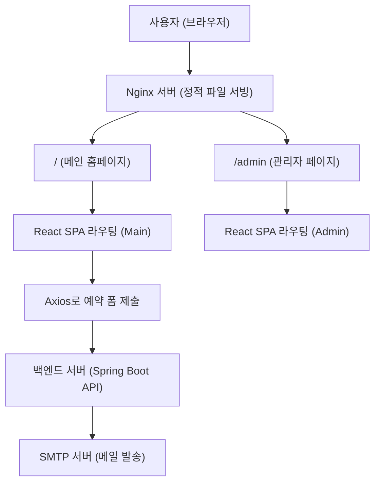

## 1. 프로젝트 개요

실제 사진 스튜디오의 요청으로 개발한 **반응형 원페이지 웹사이트**입니다.

SEO 최적화, 관리자 페이지 구성까지 **프론트엔드 90% 이상**을 담당하였습니다.

- 기간: 2025/01/01 ~ 2025/03/30
- 역할: 프론트엔드 90%
- 프로젝트 유형: 외주 / 클라이언트 요청 / 팀 프로젝트

---

## 2. 주요 기술 스택

- React 18, Vite, TypeScript, Material-UI, Emotion, React Query, Axios, React Slick, Nginx
- Google Lighthouse, PageSpeed Insights

---

## 3. 주요 기능 및 특징

### 📸 주요 화면 (PC / 모바일 비교)

| 구분 | PC 화면 | 모바일 화면 |
|:--|:--|:--|
| **1) Hero 이미지** |  |  |
| **2) 스튜디오 소개** |  |  |
| **3) 파트너 기능**<br>_(이미지 클릭 시 파트너사 홈페이지 이동)_ |  |  |
| **4) 예약/문의 기능** |  |  |
| **5) 비즈니스 슬라이드**<br>_(react-slick 기반 슬라이더)_ |  |  |
| **6) 프로필 슬라이드**<br>_(react-slick 기반 슬라이더)_ |  |  |


### 2. 관리자 페이지

- 이미지 업로드 및 Drag&Drop 정렬 기능
- 문의 이메일 설정 UI
- `/admin` 경로 별도 구성 및 배포


---

## 4. 아키텍처 및 구조

- SPA 구조 기반으로 `/`, `/admin` 라우팅 분리
- Nginx에서 정적 파일 서빙 및 라우팅 처리
- `alias` 설정 문제 해결: `/admin` 하위 리소스 경로 오류 수정
- 폴더 구조는 기능 기준으로 분리 (components, pages, utils 등)

---

## 5. 웹 성능 최적화 작업

### 📊 PageSpeed Insights 성능 비교 (개선 전 vs 개선 후)

| 지표 | 모바일 (전) | 모바일 (후) | 데스크톱 (전) | 데스크톱 (후) |
| --- | --- | --- | --- | --- |
| Lighthouse 점수 | 37점 ❌ | **86점 ✅** | 84점 ⚠️ | **92점 ✅** |
| First Contentful Paint | 4.3s | 2.7s**✅** | 1.0s | 0.9s |
| Largest Contentful Paint | 8.6s ❌ | 3.1s**✅** | 1.6s | 1.1s |
| Total Blocking Time | 960ms ❌ | **80ms ✅** | 150ms | 70ms |
| CLS | 0.001 | 0 | 0 | 0 |
### 📊 PageSpeed Insights 개선 전/후 비교 스크린샷

| 구분 | 개선 전 | 개선 후 |
|------|---------|---------|
| **모바일** | <br> | <br> |
| **데스크톱** | <br> | <br> |

### 🛠️ 적용한 최적화 기법

- ✅ WebP 이미지 변환, preload 적용, width/height 명시
- ✅ Google Fonts preconnect, preload, `font-display: swap`
- ✅ 외부 리소스 lazy load
- ✅ Gzip 텍스트 압축

```jsx
...
  #gzip 압축 활성화
    gzip on;
    gzip_disable "msie6";

    gzip_vary on;
    gzip_proxied any;
    gzip_comp_level 6;
    gzip_buffers 16 8k;
    gzip_http_version 1.1;
    gzip_min_length 1024;
    gzip_types
        text/plain
        text/css
        application/json
        application/javascript
        text/xml
        application/xml
        application/xml+rss
        text/javascript
        application/font-woff
        application/font-woff2;
...
```

---

## 6. 문제 해결 경험

1.`/admin` 라우팅 문제 (Nginx 설정)

- **문제 상황**:
    
    SPA(Single Page Application) 구조로 `/admin` 경로를 라우팅했을 때,
    
    페이지는 이동하지만 내부 JS/CSS 경로가 `/` 기준으로 설정되어
    
    정적 리소스를 로드하지 못하고 화면이 깨지는 문제가 발생
    
- **원인 분석**:
    - React 빌드 결과물에서 상대 경로가 아닌 절대 경로(`/`) 기준으로 리소스를 찾기 때문
    - Nginx의 `alias` 설정 시, 하위 경로 라우팅 및 리소스 접근 문제 발생
- **해결 방법**:
    - `location /admin` 블록 내에서 `try_files`를 다음과 같이 수정

```
location /admin {
    alias C:/sunganhomepage/nginx-1.27.4/nginx-1.27.4/sunganAdmin/dist/;
    index index.html;
    try_files $uri $uri/ /admin/index.html;
}

```

### 2. SEO 메타태그 적용 문제

- **문제**: OG 메타태그 누락으로 SNS 썸네일/타이틀이 표시되지 않음
- **해결 방법**: 각 페이지별 title, description, og:image 태그 추가 및 SNS 디버거로 확인

 
 [index.html 파일 바로 보기](/index.html)

## 9. 실행 방법

---

```bash
git clone <https://github.com/SUNGAN-Homepage/frontend-portfolio.git>
cd frontend-portfolio
npm install
npm run dev
```
